# Задание 1
## Часть 1
Установка Grav в Docker

### Установка Docker Desktop на компьютер

1.  С официального сайта **Docker** скачиваем установочный файл

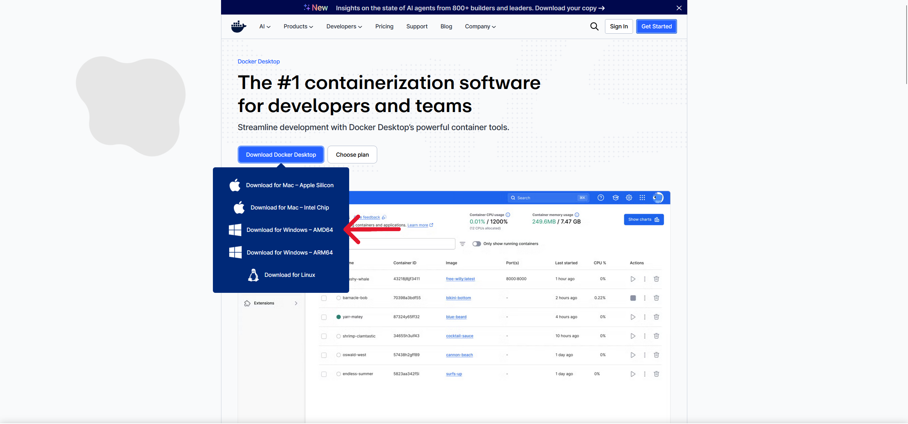

2. После скачивания - запускаем установочный файл и следуем инструкциям

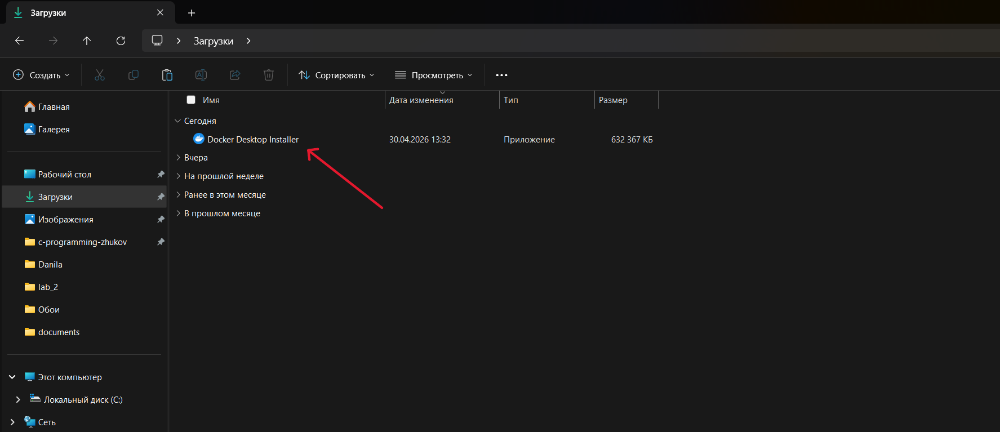

3. После завершения установки - откроется Docker Desktop

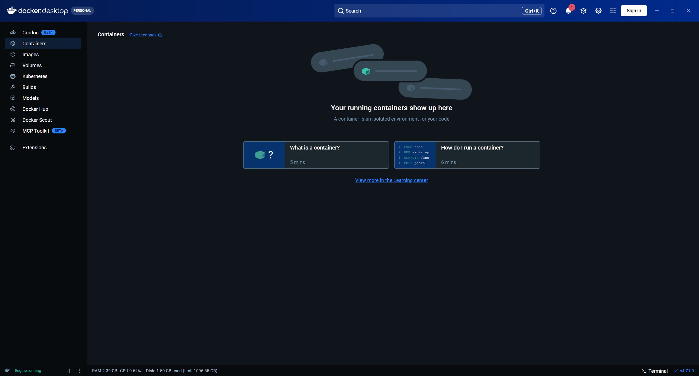

### Запуск Grav в Docker

1.  Создаём папку для проекта

```powershell
mkdir C:\Users\Danila\grav
cd C:\Users\Danila\grav
```
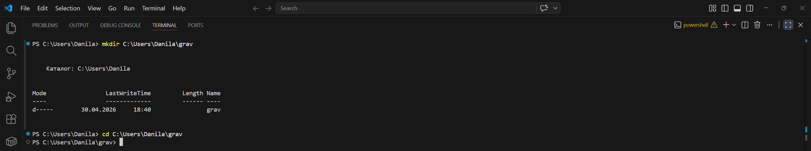

2. Создаём файл _docker-compose.yml_ и копируем в него содержимое того же файла из официального репозитория

```powershell
notepad docker-compose.yml
```

```yaml
services:
  grav:
    image: getgrav/grav
    container_name: grav
    ports:
      - "8080:80"
    volumes:
      - grav_site:/var/www/html
    restart: unless-stopped

volumes:
  grav_site:
```

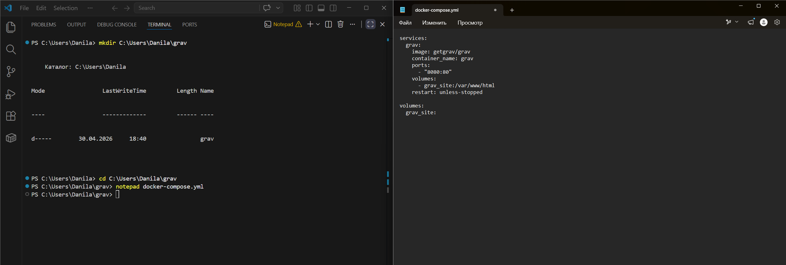

3. Запуск контейнера

```powershell
docker compose up -d
```
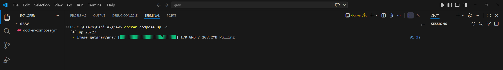

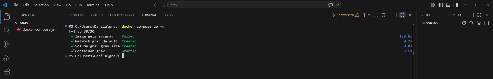

4. После запуска контейнера ждём несколько минут (для того чтобы grav установился). Для проверки можно использовать команду:

```powershell
docker logs grav -f
```
5. После вывода в терминал "Grav installation complete!" можем выйти **Ctrl+C** из терминала, а после открыть в браузере _http://localhost:8080_

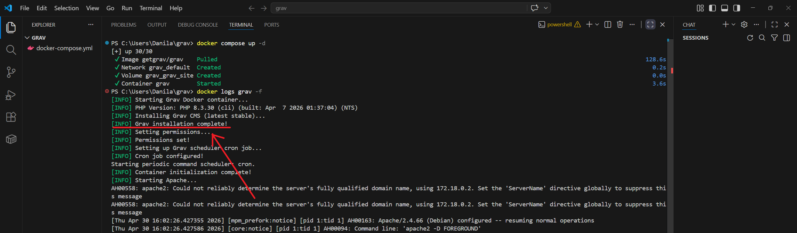

6. После того как в браузере мы открыли _http://localhost:8080_, мы должны увидеть следующие:

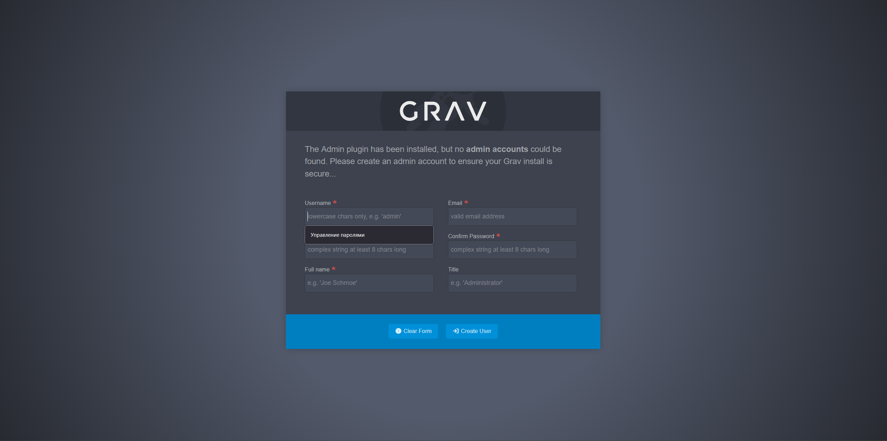

7. Заполняем информацию

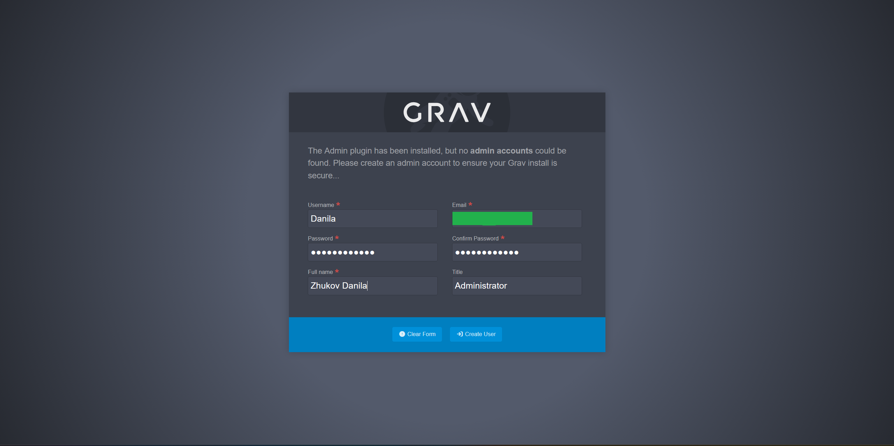

8. После заполнения информации, мы войдём в панель администратора

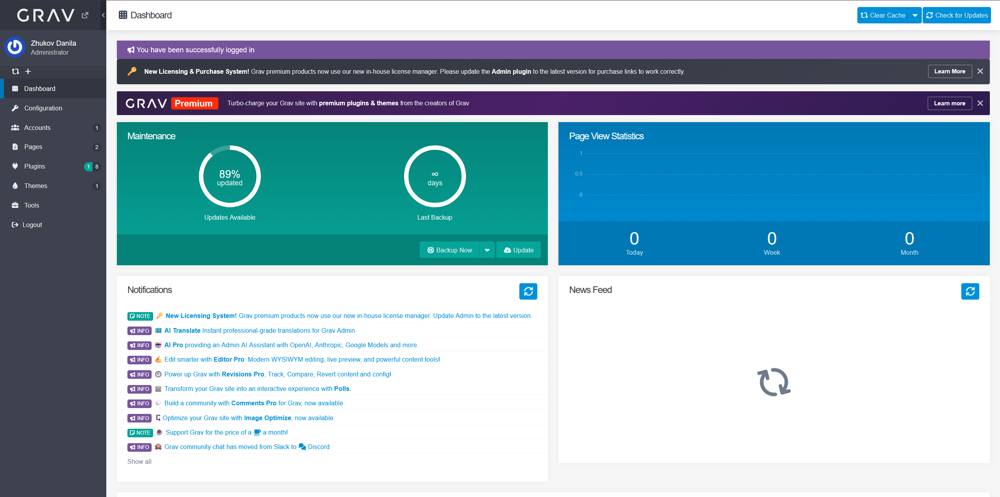

9. Рекомендуется обновить

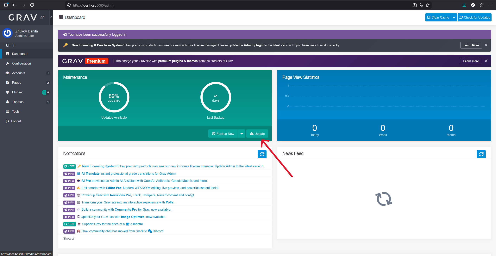

10. Далее мы можем начать создание страниц, для этого переходим в вкладку **Pages**

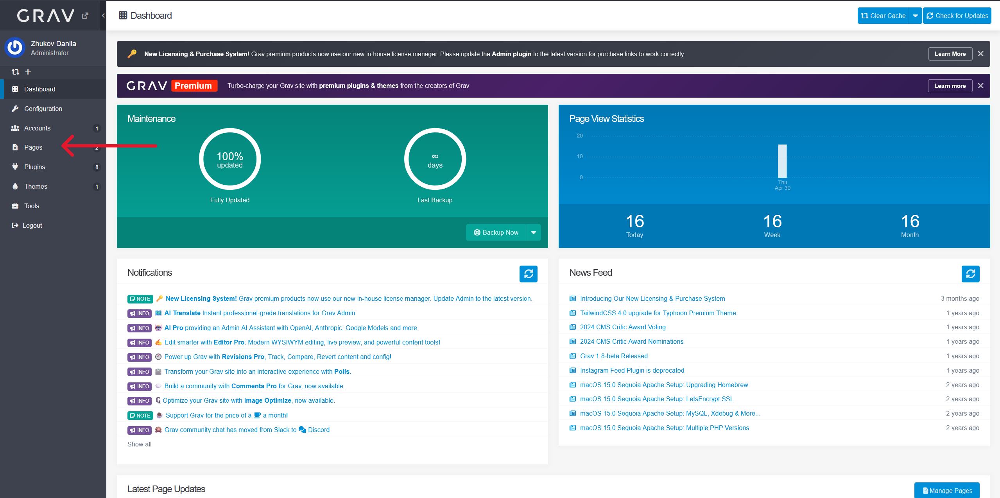   

11. И создадим новую страницу

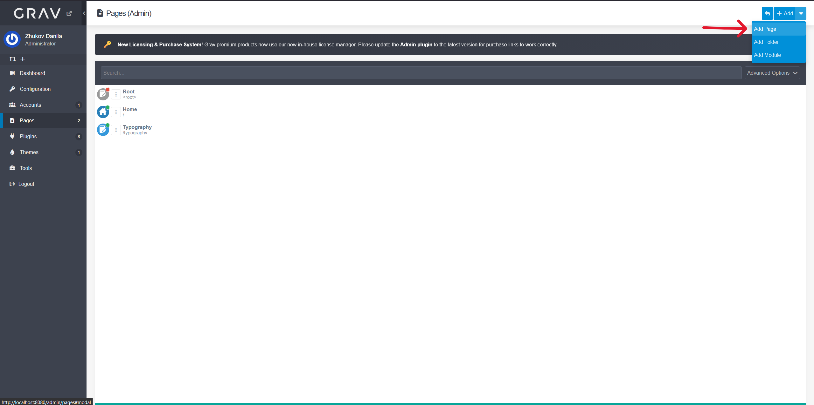  

12. Указываем параметры страницы

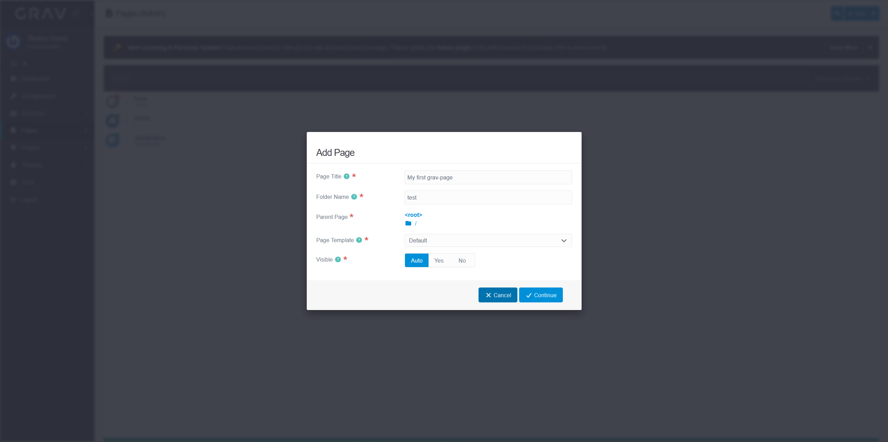

13. Пишем информацию, которая будет отображаться на странице и сохраняем

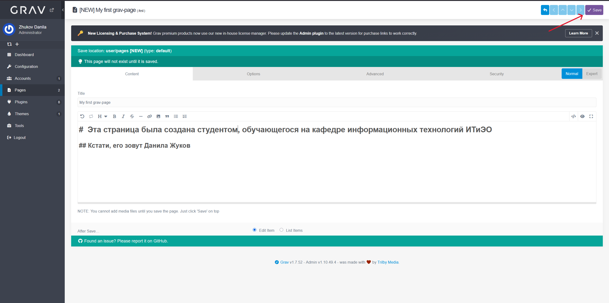

14. Переходим по ссылке _http://localhost:8080_ (без _admin/pages/test_) где мы можем посмотеть на нашу страницу без привилегий админа

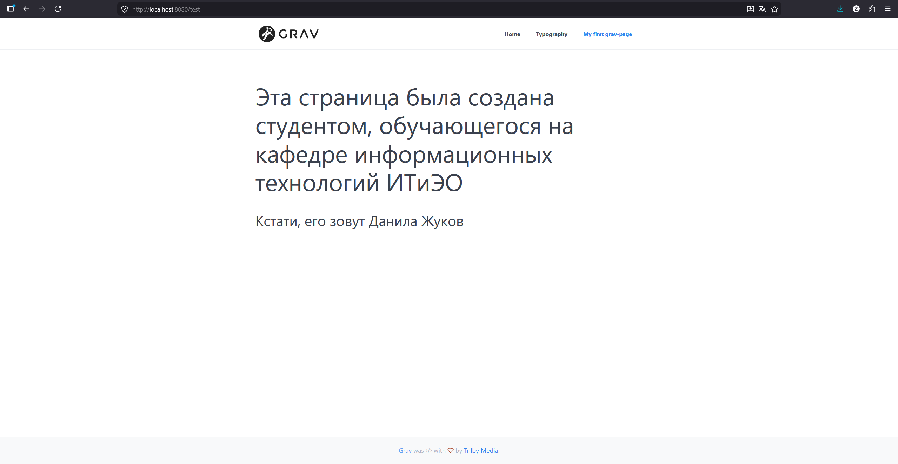

15. После того как мы выполнили все наши действия, мы можем завершить работу контеёнера Docker, выполнив в терминале команду:

```powershell
docker compous down
```
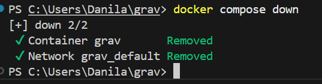

После этого наши страницы будут недоступны 

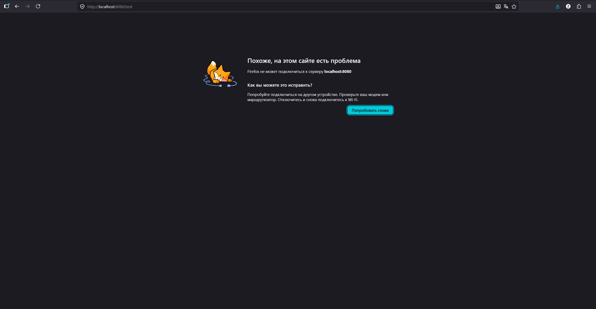

## Часть 2

### Изучить дизайн альтернативной версии сайта кафедры

#### Анализ альтернативной версии сайта кафедры на сервисе **Figma**

##### Цветовая схема

* Основной цвет — фиолетовый/пурпурный (боковая панель, шапка)
* Акцентный цвет — оранжевый (кнопки, "подвал", выделения)
* Фон — светло-серый/белый

##### Структура

* Боковое меню слева
* Основной контент справа от меню
* Логотип кафедры в верхнем левом углу в фиолетовом блоке

#### Стиль

* Чистый, минималистичный
* Много белого пространства

### Найти 2 различные темы оформления для сайта CMS Grav

#### Тема №1 максимально похожа на альтернативный дизайн версии сайта кафедры в **Figma**

Используя сеть интернет, мной была найдена тема **Editorial** [https://editorial.pmdesign.dev/]. Это самый близкий вариант к альтернативной версии сайта кафедры - фиксированное боковое меню слева, чистый белый контент справа, минималистичный стиль и структура страницы один в один повторяют макет из Figma.

#### Тема №2 должна быть быть максимально адекватна специфике внешнего оформления сайта кафедры

В качестве референса для темы №2 был использован стиль сайта МГУ им. М.В.Ломоносова [https://msu.ru/]. Была найдена тема **Bootstrap4** [https://demo.hibbittsdesign.org/grav-theme-bootstrap4-open-matter/], которая по структуре и стилю наиболее близка к типичному сайту университета - горизонтальная навигация, чистый светлый дизайн, чёткая иерархия контента.

## Часть 3

### Инсталлировать темы в развернутый локально сайт на Grav. И создать 1 информационную страницу в каждой теме, где можно было бы наглядно оценить её дизайн.

#### Тема №1 максимально похожа на альтернативный дизайн версии сайта кафедры в **Figma**

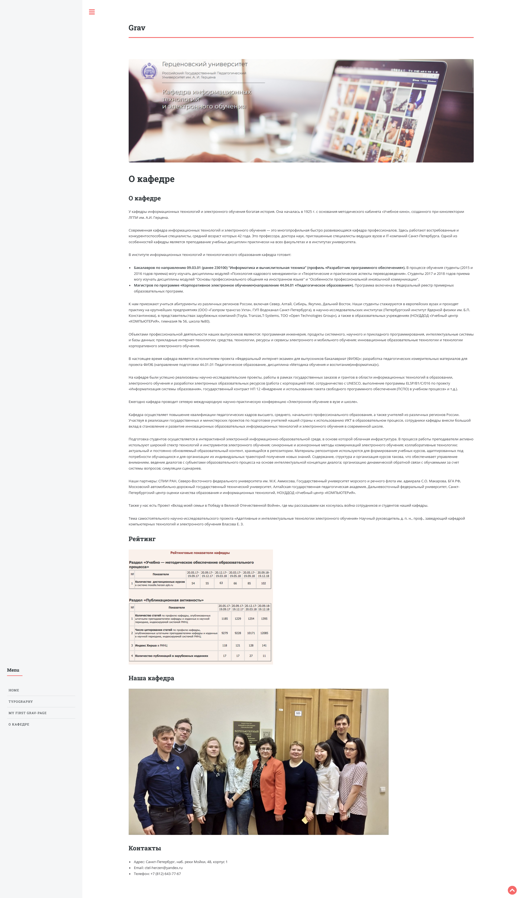

##### Комментарий 

Страница в теме Editorial получилась достаточно похожа:

* Боковое меню слева
* Минималистичный стиль
* Цвета немного не совпадают, но не выгляд инородно

#### Тема №2 должна быть быть максимально адекватна специфике внешнего оформления сайта кафедры

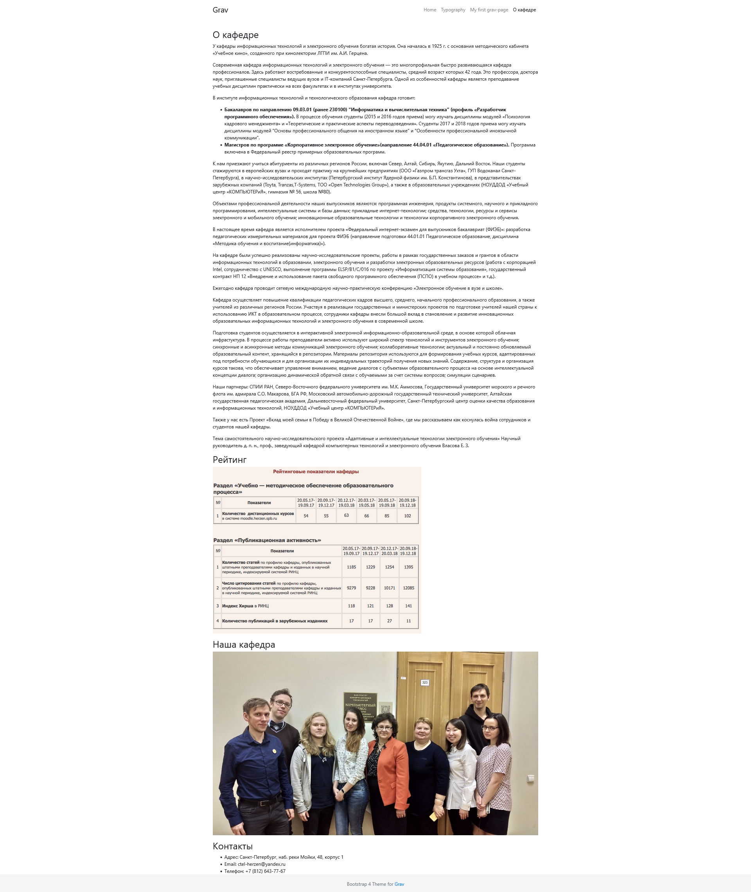

#### Комментарий

Страница в теме Bootstrap4 соответствует стилю типичного сайта университета:

* Горизонтальная навигация сверху — как на сайте МГУ
* Чистый минималистичный дизайн
* Хорошая читаемость контента
* Тема подходит для сайта кафедры благодаря 
  строгому академическому стилю
