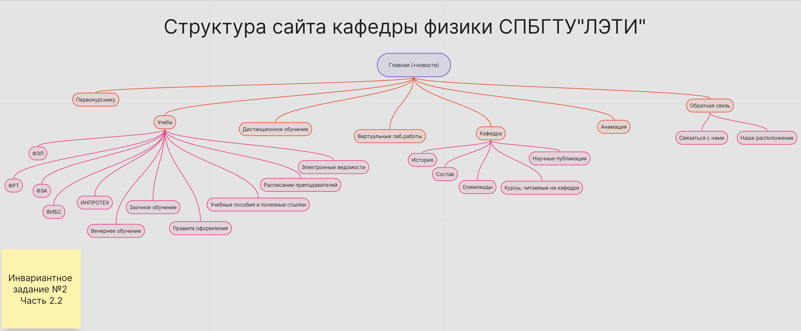
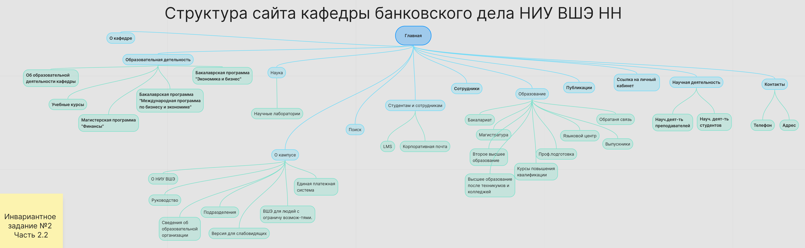

# Задание 2

## Часть 1

Исследовать структуру официального сайта кафедры информационных технологий и электронного обучения (ИТиЭО) и составить структуру сайта, используя сервис **Holst**

### Cтруктуру сайта кафедра ИТиЭО 

## Часть 2 

Проанализировать 1-3 сайтов кафедр (и/или факультетов, выбрать наиболее качественные) других вузов и составить структуры их сайтов. Провести сравнительный анализ проанализированных ресурсов и описать какие разделы отсутствуют на сайте кафедры ИТиЭО и вы бы рекомендовали добавить.

### Структура сайта факультета прикладной математики - процессов управления СПбГУ

### Структура сайта кафедры физики СПБГТУ "ЛЭТИ"

### Структура сайта кафедры банковского дела НИУ ВШЭ НН

### Сравнительный анализ

| Критерий | Кафедра ИТиЭО (РГПУ им. Герцена) | Факультет ПМ-ПУ (СПбГУ) | Кафедра физики СПБГТУ"ЛЭТИ" | Кафедра банковского дела (НИУ ВШЭ НН) |
|-------------|-------------|-------------|-------------|-------------|
| О кафедре | Да | Да | Да | Да |
| Новости | Да | Да | Да | Нет |
| Абитуриентам | Да | Да | Нет | Нет |
| Студентам | Да | Да | Нет | Да |
| Выпускники | Да | Нет | Нет | Нет |
| Учебный план | Да | Да | Да | Да |
| Фотогалерея | Да | Нет | Нет | Нет |
| Образовательные программы | Да | Да | Да | Да |
| Сотрудники и руководство | Да | Да | Да | Да |
| Публикации | Да | Да | Да | Да |
| Контакты | Да | Да | Да | Да |
| Научная деятельность | Да | Да | Да | Да |
| Поиск | Нет | Да | Да | Да |
| Ссылка на личный кабинет | Нет | Нет | Нет | Да |
| Версия для слабовидящих | Нет | Нет | Да | Да |
| Платежная страница | Нет | Нет | Нет | Да |
| Партнеры | Да | Нет | Да | Нет |
| Приказы и комиссии | Нет | Да | Нет | Нет |
| Переводы и восстановления | Нет | Да | Нет | Нет |
| Олимпиады | Нет | Да | Да | Нет |
| Расписание преподавателей | Нет | Нет | Да | Нет |

### Вывод
Сайт кафедры ИТиЭО (РГПУ им. Герцена) достаточно функционален, содержит в себе основную информацию. В качестве рекомендации можно добавить поиск для быстрой навигации по сайту, ссылку на личный кабинет, версию для слабовидящих, платежную страницу для быстрого доступа к оплате обучения. 

## Часть 3

Составить список сервисов (функций), которые вам, как студентам, были бы полезны и актуальны для использования на сайте кафедры. Составьте таблицу со столбцами ("Сервис/Функция, которая была бы актуальна на сайте кафедры", Инструмент реализации функционала", "Комментарий с аргументацией"). Опишите 5-10 необходимых, с вашей точки зрения, функций. Аргументируйте, по возможно лаконично, свой ответ. 

##### Список сервисов (функций), которые были бы полезны и актуальны для использования на сайте кафедры
| Сервис/Функция | Инструмент реализации функционала | Комментарий с аргументацией |
|-------------|-------------|-------------|
| Расписание занятий | Онлайн-таблицы/яндекс календарь | Студент всегда сможет видеть актуальное расписание, в случае изменений (отмены занятия, перенос в другую аудиторию и т.д.) информация будет обновляться автоматически, что снизит количество студентов, не проинформированных об изменениях |
| Занятость преподавателей | Онлайн-таблицы/яндекс календарь | Часто студентам требуется найти определенного преподавателя, но не всегда есть информация, где его можно найти. С этой функцией будет возможность посмотреть, в какой аудитории можно найти преподавателя, свободен ли он |
| Форма онлайн-записи на консультацию / к научному руководителю | Google Календарь с слотами (Calendly) или плагин Appointment Booking | Избавляет от очередей и «ловли» преподавателя. Студент выбирает свободное время |
| Чат / форма быстрого вопроса преподавателю или завкафедрой | Telegram-бот или форма обратной связи | Студенту не нужно искать личный контакт преподавателя. Вопрос можно задать анонимно или открыто. Ускоряет решение проблем |
| Сбор обратной связи | Яндекс формы | Можно создать опросы для сбора обратной связи по образовательному процессу, заданиям, формам занятий и т.д., что позволит улучшать процесс |
| База знаний / Учебные материалы | Notion (публичная страница)/Облачное хранилище (Google Drive / Яндекс.Диск) с разбивкой по папкам и ссылками на сайте | Студент в одном месте находит лекции, методички, лабораторные, вопросы к экзаменам без поиска по папкам в мессенджерах. Доступ открыт 24/7 с телефона или ноутбука. |
| Интерактивные карты корпусов | Яндекс карты | С большим количеством корпусов этот сервис был бы очень полезен: студенты могли бы быстро находить нужную аудиторию, деканат, кафедру |
| Новости и события с фильтрацией | Телеграм-бот+ виджет на сайте + JS-фильтрация | Студент не пролистывает десятки постов в поисках нужного. Он может отфильтровать новости по категориям («только олимпиады», «только вакансии», «только изменения в расписании») и сразу видеть важное |
| Раздел «Частые вопросы (FAQ) | Обычная страница с аккордеоном (JS) | Студент получает ответ за 10 секунд вместо того, чтобы писать преподавателю или в чат. Снимает типовые вопросы («Как попасть на практику?», «Где взять тему курсовой?», «Что делать, если пропустил экзамен?») |
| Онлайн-тренажеры | Яндекс формы | Студентам намного комфортнее выполнять интерактивные задания, решение онлайн-тестов может помочь для подготовки к экзаменам и зачетам или для понимания сложных тем |

#### Ссылка на проект Holst 

https://app.holst.so/invite/48e50a12-dd83-499a-b37d-2c0db357d2b9

