# Задание 5 

## Часть 1

Представить в виде таблицы список направлений и расширений (плагинов для Grav), которые могут помочь в реализации этих направлений. В таблице указать: направление, ссылку и краткое описание расширения с вашим комментарием: почему оно было выбрано.

Направления: проведение конференции; публикация расписания преподавателей; публикация тематической справочной информации;

| Направление | Плагин | Ссылка | Почему выбран |
|---|---|---|---|
| Проведение конференции | Events | https://github.com/kalebheitzman/grav-plugin-events | Позволяет создавать одиночные и повторяющиеся события с датами, временем и шаблоном календаря - идеально для анонсов конференций |
| Публикация расписания преподавателей | Table Importer | https://github.com/jwrobb/grav-plugin-table-importer | Импортирует CSV/YAML/JSON файл и отображает как HTML-таблицу|
| Публикация тематической справочной информации | DataTables | https://github.com/finanalyst/grav-plugin-datatables | Добавляет интерактивную таблицу с поиском и сортировкой - удобно для большого объёма справочных данных |

## Часть 2

Выбрать одно направление из 1 части данного задания и установить данный плагин в локально развернутый Grav, настроить и продемонстрировать его работу (пошаговое описание со скриншотами работы с ним). 

### Пошаговое описание 

Направления: публикация расписания преподавателей.
Плагин: Table Importer

### Шаг №1

Запуск контейнера Docker с Grav 

```powershell
docker-compose up -d
```

Переход в админ-панель Grav

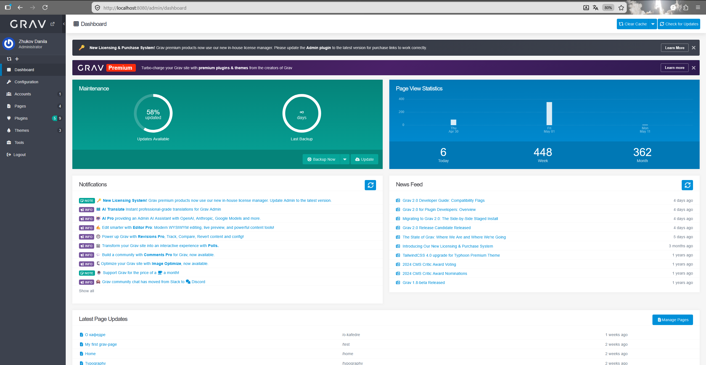

### Шаг №2

Перейди в раздел Plugins
Нажимаем Plugins в левом меню, затем кнопку +Add в правом верхнем углу.

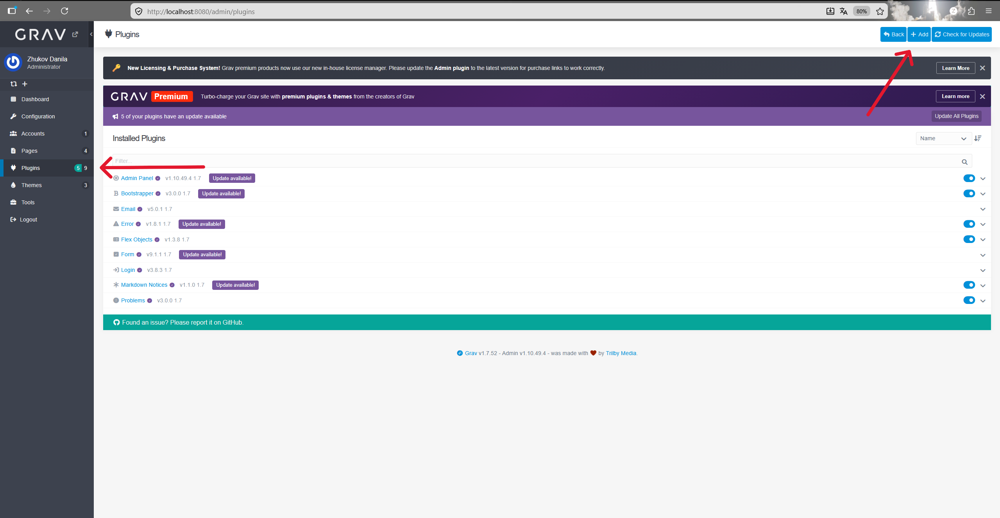

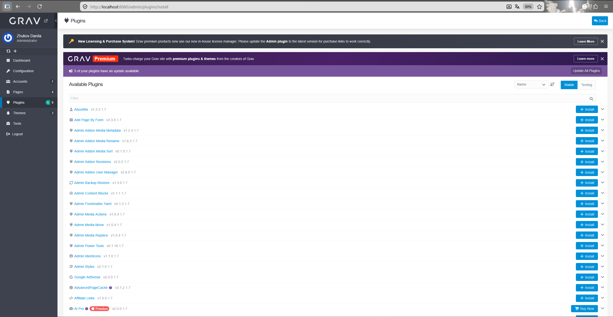

### Шаг №3

Table Importer требует Shortcode Core как зависимость, поэтому сначала установим его.Находим плагин Shortcode Core и нажимаем + Install.

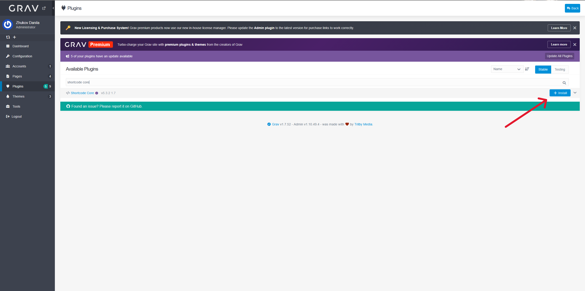

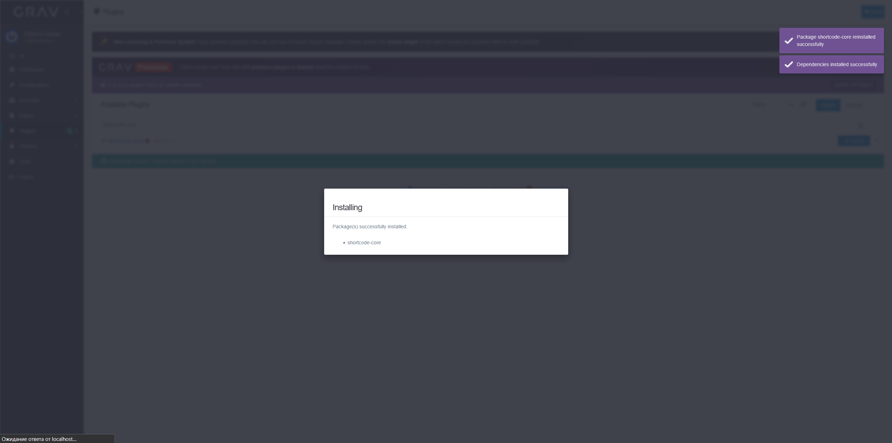

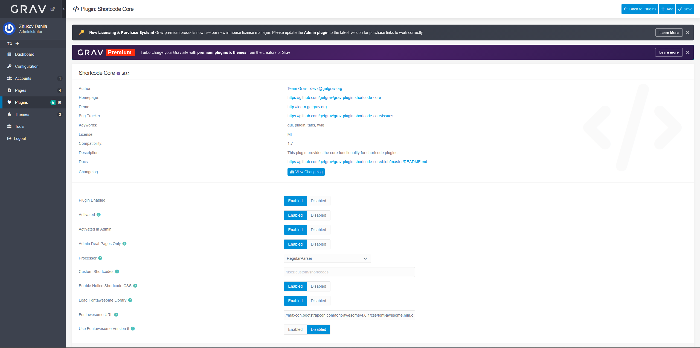

### Шаг №4

После установки Shortcode Core повторяем шаг №3 для Table Importer

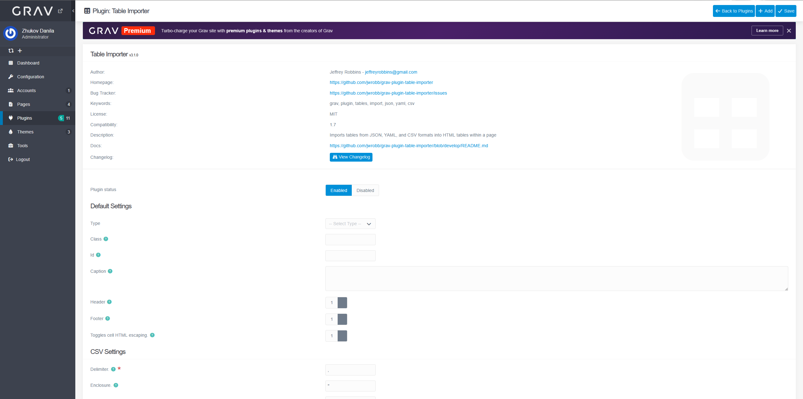

### Шаг №5

Далее созадем новую страницу 

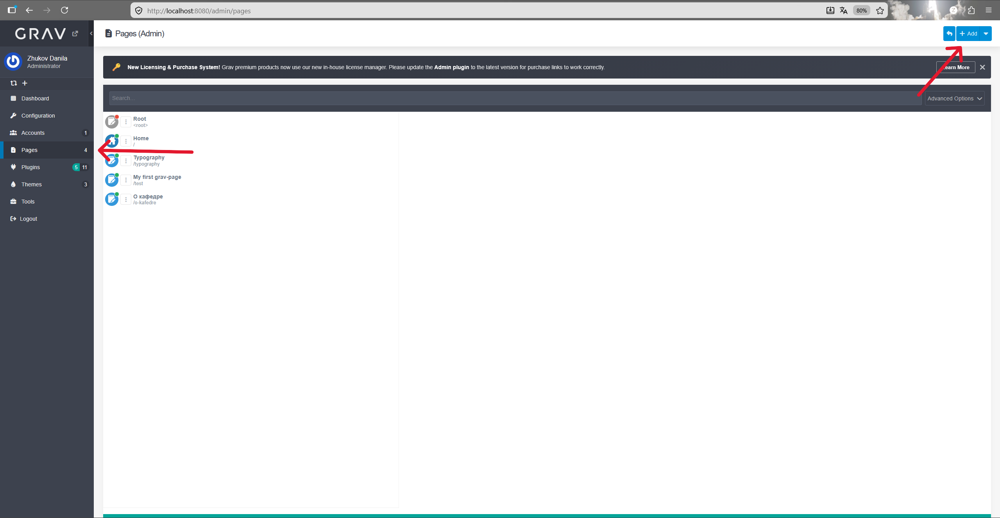

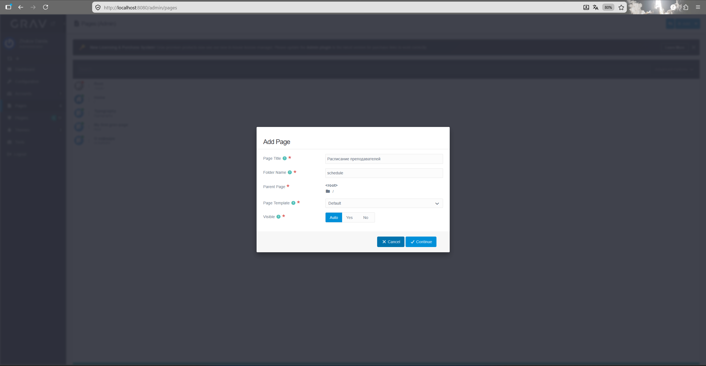

Нажимаем иконку Toggle Editor в правом верхнем углу текстового редактора, чтобы переключиться в режим Markdown. Затем вставляем:
```markdown
# Расписание преподавателей
[ti type="csv" file="schedule.csv" /]
```
После этого нажмимаем Save - страница сохранится, и появится возможность загрузить CSV-файл.

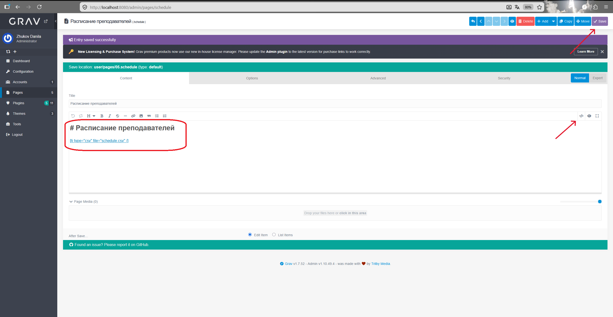

### Шаг №6

Создаём CSV файл с расписанием

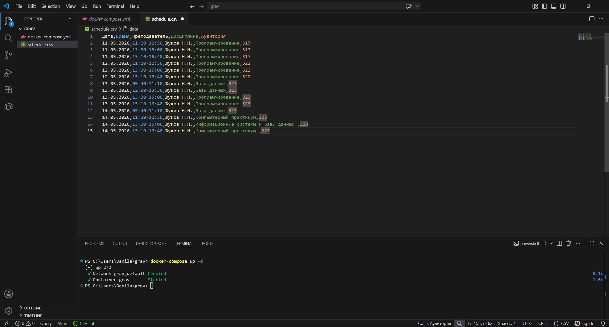

Выполняем в терминале команду 
```powershell
docker cp C:\Users\Danila\grav\schedule.csv grav:/var/www/html/user/pages/05.schedule/schedule.csv
```

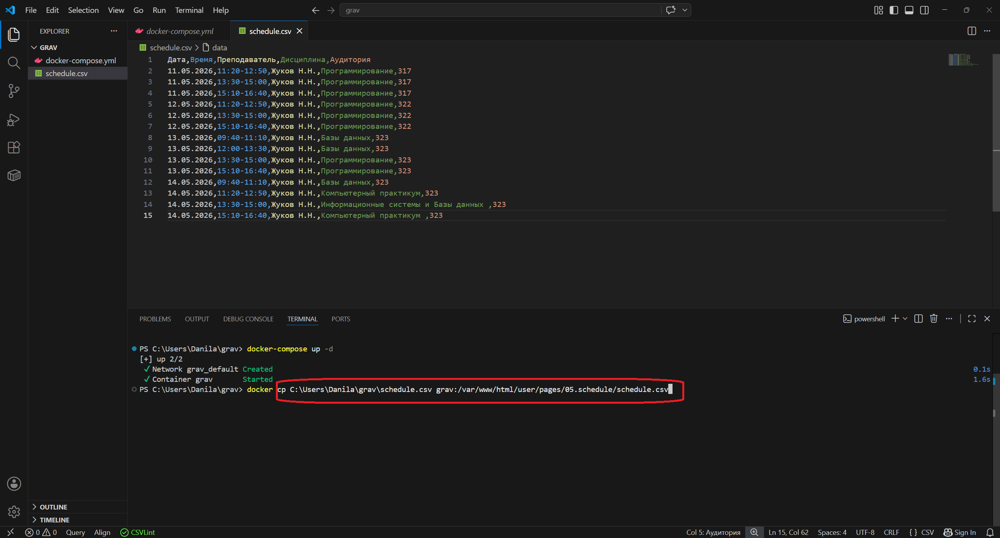

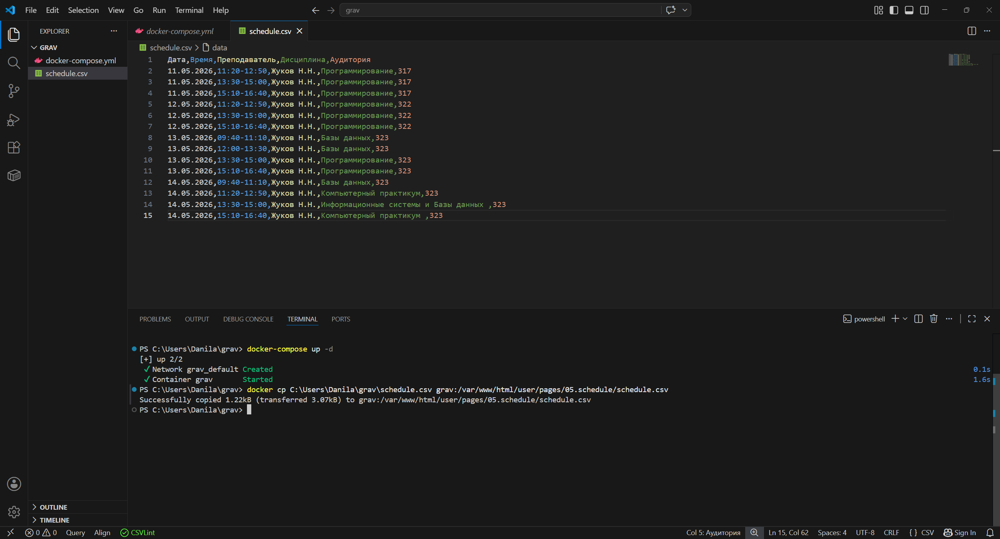

### Шаг №7

Открываем ссылку http://localhost:8080/schedule и у нас должно отобразиться расписание

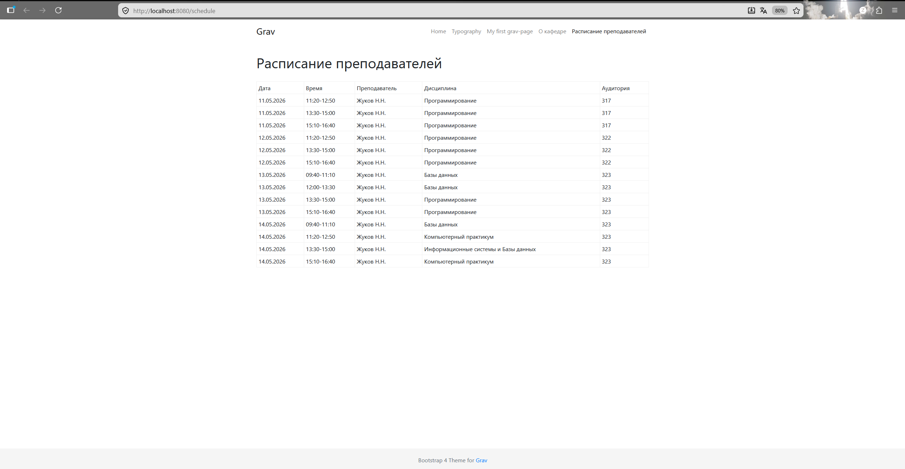